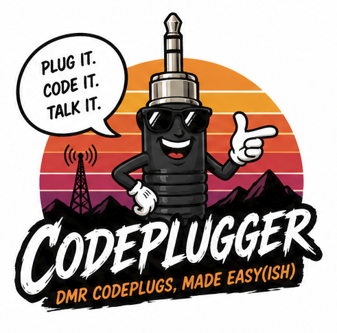

# CODEPLUGGER

Automatic codeplug generation for the **Baofeng DM-32UV** DMR radio.

Pulls repeater data from RadioID, BrandMeister, and a bundled database of 16,000+
repeaters built from RepeaterBook KML data and regional directory PDFs. Produces
4 CSV files ready to import into the DM-32UV CPS programming software.

Available as a **web UI** and a **command-line tool**.



---

## Install — Windows, Step by Step

**For hams who've used a computer for years but never touched Python, GitHub, or a terminal. About 30 minutes the first time.**

### What you'll need

- A Windows 10 or 11 computer
- An internet connection
- About 200 MB of free disk space
- The Baofeng DM-32UV CPS programming software (already installed for use with your radio)

That's it. No accounts, no API keys required.

---

### Step 1 — Install Python (one-time, about 5 minutes)

CODEPLUGGER is written in Python, so you need to install Python first. Python is free.

1. Open your web browser and go to **https://www.python.org/downloads/**
2. Click the big yellow **"Download Python 3.12.x"** button (the version number after 3.12 doesn't matter — any 3.12 works)
3. Open the file you just downloaded (it's in your Downloads folder)
4. **VERY IMPORTANT:** at the bottom of the installer window, check the box that says **"Add python.exe to PATH"** — if you skip this, nothing else will work
5. Click **"Install Now"**
6. When it says "Setup was successful", click **"Close"**

**To check it worked:** Press the Windows key, type `cmd`, press Enter. A black window opens. Type:
```
python --version
```
Press Enter. You should see `Python 3.12.something`. If you see "not recognized as a command," you missed the PATH checkbox in step 4 — uninstall Python and start over.

Close that window when you're done.

---

### Step 2 — Download CODEPLUGGER (one-time, about 1 minute)

1. Go to **https://github.com/jimdawdy-hub/codeplugger**
2. Click the green **"Code"** button (top right of the file list)
3. Click **"Download ZIP"** at the bottom of the menu that pops down
4. Find the downloaded file `codeplugger-main.zip` (in your Downloads folder)
5. Right-click it → **"Extract All..."** → choose a place you'll remember (your Documents folder is a good choice) → click **"Extract"**

You now have a folder like `Documents\codeplugger-main\` with the app inside it.

---

### Step 3 — Install the app's dependencies (one-time, about 2 minutes)

1. Open File Explorer and navigate **into** the `codeplugger-main` folder you just extracted
2. Click on the address bar at the top of File Explorer (where it shows the folder path)
3. Type `cmd` and press Enter — a black Command Prompt window opens, already pointing at the right folder
4. In that window, type exactly:
   ```
   pip install -r requirements.txt
   ```
   and press Enter
5. Wait 1–2 minutes. You'll see a lot of lines scrolling by saying "Collecting..." and "Installing..." — that's normal. When the prompt (`C:\...>`) comes back by itself, it's done.

---

### Step 4 — Start the app (every time you want to use it)

In the same Command Prompt window from Step 3, type:
```
python -m uvicorn web.app:app --port 8000
```
and press Enter.

You should see something like this:
```
INFO:     Started server process [12345]
INFO:     Application startup complete.
INFO:     Uvicorn running on http://127.0.0.1:8000
```

**Leave this window open!** Closing it shuts down the app. You can minimize it, just don't close it.

---

### Step 5 — Use the app

1. Open your web browser (Chrome, Edge, Firefox, whatever you normally use)
2. In the address bar, type: **`http://localhost:8000`** and press Enter
3. The CODEPLUGGER page loads — fill in the form, generate your codeplug, download the ZIP
4. Unzip the downloaded codeplug and import the 4 CSV files into the DM-32UV CPS software in this exact order:
   1. **Talk Groups**
   2. **RX Group Lists**
   3. **Channels**
   4. **Zones**

A `README.txt` is included in the ZIP that explains the import order again.

---

### Stopping the app

Click the Command Prompt window, then hold **Ctrl** and press **C** once. The server stops. You can close the window.

### Using it again later

You only have to do Steps 1–3 *once*. To use the app again on another day:

1. Open File Explorer, go to `Documents\codeplugger-main\`
2. Click the address bar, type `cmd`, press Enter
3. Type `python -m uvicorn web.app:app --port 8000` and press Enter
4. Open your browser to `http://localhost:8000`

---

### Troubleshooting

| Problem | Fix |
|---|---|
| `'pip' is not recognized` | You missed the "Add Python to PATH" checkbox in Step 1. Uninstall Python from Settings → Apps, then redo Step 1 with the box checked. |
| `'python' is not recognized` | Same as above. |
| `Port 8000 is already in use` | Another program is using port 8000. Use `--port 8001` instead, then visit `http://localhost:8001` |
| Browser says "This site can't be reached" | The Command Prompt window is closed. Restart it (Step 4). |
| "Permission denied" during pip install | Right-click Command Prompt and choose "Run as administrator", then redo Step 3. |
| Need help | Open an issue at https://github.com/jimdawdy-hub/codeplugger/issues |

---

## What the app does

1. Enter your **DMR ID** — your callsign and name are filled in automatically
2. Pick one or more **states** to search
3. Choose which **networks** you care about (BrandMeister, DMR-MARC, Tristate)
4. The app searches RadioID and shows you every DMR repeater in those states — check/uncheck to include or exclude. A green ✓BM badge means the repeater is verified on the BrandMeister network.
5. Click **Search Analog Repeaters** to add FM repeaters from the bundled database (16,000+ across all 50 states). They'll be grouped into zones by state and band — for example "IL 2m Analog", "IN 70cm Analog".
6. Pick **hotspot talkgroups** from the catalog (1,700+ TGs grouped by Wide Area, US States, Countries, Language, Activity, etc.) — each category has a "Select All" checkbox
7. Set TX power and hotspot frequency
8. Agree to the disclaimer, type your initials, click **Generate & Download** — you get a ZIP containing the 4 CSV files plus a README

---

## Optional: BrandMeister API Key

If you have a BrandMeister account, you can add an API key to get a green ✓BM verification badge on repeaters that are confirmed on the BM network. **This is completely optional — the app works fine without it.**

1. Log in at https://brandmeister.network and go to your profile → API keys
2. Generate a new API key
3. Create a file at `C:\Users\YourName\.config\dmr-codeplug.json` with this content (replace the X's with your actual key):
   ```json
   {"brandmeister_api_key": "XXXXXXXXXXXXXXXXX"}
   ```
4. Restart the app

---

## CLI (for power users)

```bash
python main.py \
  --dmr-id 3179879 \
  --city Chicago --state Illinois \
  --networks BrandMeister DMR-MARC Tristate \
  --max 40 \
  --hotspot --hs-tgs 91 93 3117 3118 9 310 312 \
  --out ./my_codeplug
```

Other useful flags:
- `--dry-run` — show what would be generated without writing files
- `--list-hs-tgs` — list available hotspot talkgroups
- `--refresh-bm` — force re-download of BrandMeister cache

---

## Rebuilding the repeater database

The bundled `data/repeaters.db` is built from a Google Drive ZIP of RepeaterBook KML files plus regional PDF directories. To refresh it:

```bash
python import_data.py
```

The KML ZIP can be downloaded from https://drive.google.com/drive/folders/10Lvzkdtox8vG7iNkpQHSOIUfn8yUNV5b — drop it in the project root and run the import.

---

## Output

Four CSV files for import into the DM-32UV CPS — **in this order:**

| # | File | Contents |
|---|------|----------|
| 1 | `talk_groups.csv` | Talkgroup list (TX Contact references these by name) |
| 2 | `rx_group_lists.csv` | Receive group lists |
| 3 | `channels.csv` | One channel per talkgroup per repeater, plus hotspot zones and analog channels |
| 4 | `zones.csv` | Per-repeater zones, per-category hotspot zones, per-state/band analog zones |

---

## Features

- **Bundled repeater database** — 16,000+ analog repeaters from all 50 states, no API keys required
- **State-only search** — pick states, get all repeaters, choose what you want
- **Per-category hotspot zones** — Wide Area, US States, Countries, Language, Activity, Emcomm, Link — each capped at 64 channels with overflow paging
- **Mandatory disconnect** — every hotspot zone ends with TG 4000 disconnect; users can't accidentally omit it
- **Per-state/band analog zones** — separate "IL 2m Analog", "IL 70cm Analog", "IN 2m Analog" zones rather than one giant Analog zone
- **BrandMeister verification** (optional, with key) — cross-references RadioID data against BM device registry
- **Official TG names from CSV** — bundled BM talkgroup catalog (1,700+ entries)
- **Parrot Private Call** — TG 9990 and 310997 correctly configured as Private Call (required for echo test)
- **12-char name limit** — clean LCD display on the radio

---

## Project structure

```
codeplug/
├── models.py          — Dataclasses: Repeater, Channel, Zone, Codeplug, etc.
├── radioid.py         — RadioID.net API client
├── brandmeister.py    — BrandMeister API client + caching
├── bm_talkgroups.py   — BM talkgroup catalog loader (CSV)
├── repeater_db.py     — Local SQLite repeater database
├── kml_import.py      — RepeaterBook KML/KMZ importer
├── pdf_import.py      — Regional repeater directory PDF parsers
├── hearham_import.py  — HearHam.com DMR talkgroup scraper
├── defaults.py        — TG abbreviations, network prefixes
├── builder.py         — CodeplugBuilder: assembles codeplug from repeater data
└── csv_export.py      — Writes the 4 DM-32UV CSV files

web/
├── app.py             — FastAPI backend
└── static/index.html  — Single-page dark-themed UI

main.py                — CLI entry point
import_data.py         — Repeater database build tool
```

---

## Notes

- Tested with the **Baofeng DM-32UV** and its CPS software
- `GroupCall Match = Off` is recommended for ham use — the radio hears all traffic on matching frequency/color code/timeslot regardless of talkgroup
- See `LESSONS_LEARNED.md` for DMR domain knowledge and CPS quirks
- See `ONBOARDING.md` for full architecture and development history

---

*© 2026 James Dawdy, KQ9I — not affiliated with Baofeng, BrandMeister, or RadioID.net*
